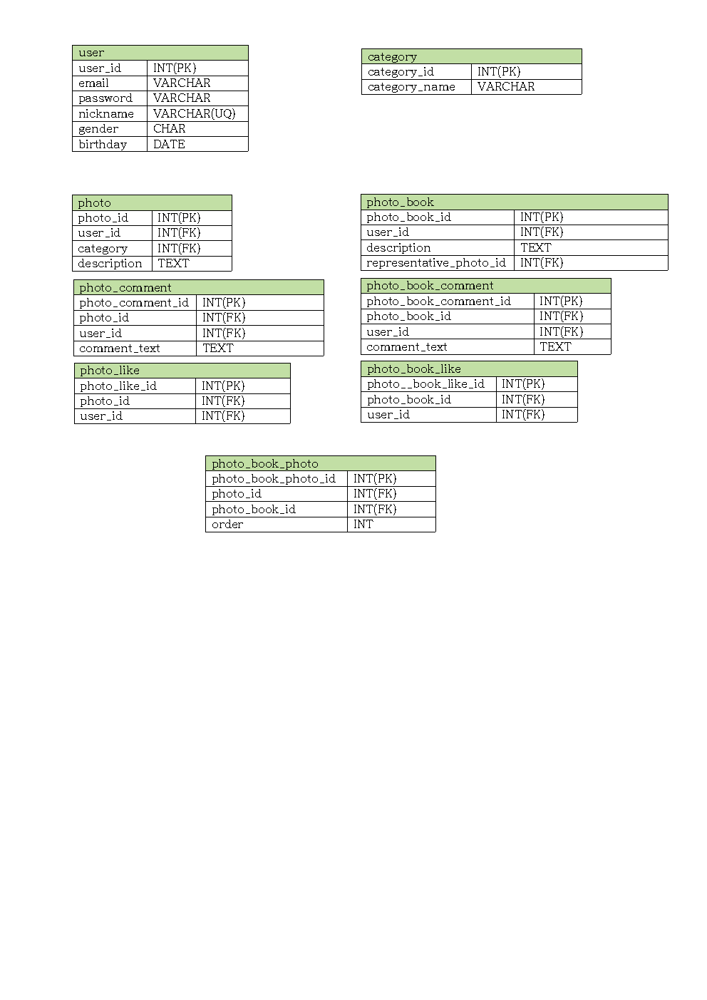
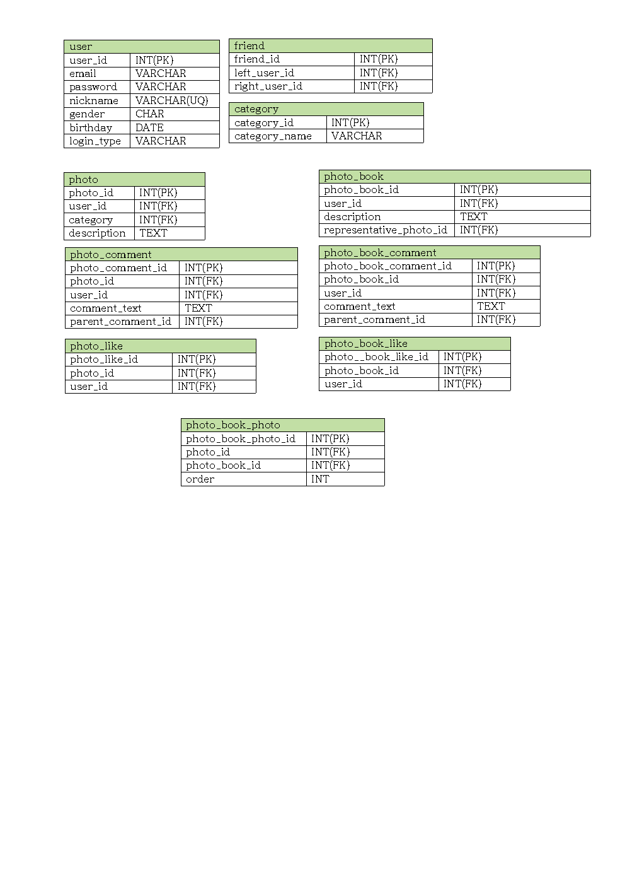

# bucket place

## 1

### 1-A

1. SELECT * FROM cards;

2. 문제가 잘 이해되지 않아서 이해한 대로 답을 써보았습니다.
    * 현재 사용자가 사진 담기한 사진들의 list
        * SELECT * FROM cards LEFT OUTER JOIN collects ON cards.id = collects.card_id WHERE user_id=(현재 사용자 id);

    * 현재 사용자가 누가 사진 담기 했든 사진 담기 되어 있는지 보려는 경우 
        * SELECT * FROM cards LEFT OUTER JOIN collects ON cards.id = collects.card_id ;

3. 1번은 로그인 여부를 판단해야하는 경우 일 수도 있고 아닐 수도 있다고 생각합니다.
2번은 현재 사용자의 사진 담기 여부를 판단해야하기에 로그인 여부를 판단해야 한다고 생각합니다.

### 1-B

1. SELECT * FROM collection_books WHERE user_id=(현재 사용자 id);

2. 대표 사진을 어떻게 설정하는지 정보가 없어서 이해한 대로 답을 써보았습니다.
    * 처음에는 대표 사진이 무엇인지 몰라서 가장 최근에 사진 담기한 사진을 대표 사진으로 생각해고 가져오는 SQL 을 생각했습니다.
        * SELECT a.id,a.user_id,collects.collection_book_id, MAX(collects.created_at),ANY_VALUE(collects.card_id) FROM (SELECT * FROM collection_books WHERE user_id=4) a JOIN collects ON a.id=collects.collection_book_id GROUP BY collects.collection_book_id;

    * 하지만 다음 2번 문제를 풀면서 데이터베이스를 설계할 때 대표 사진이 무엇인지 db 에 저장해 놓았습니다. 때문에 제가 설계한 대로 1번의 database 를 구성했다 생각하면 collects 에 대표사진의 여부를 판단할 column 이 있다고 설계했을 때 SQL 은
        * SELECT * FROM (SELECT * FROM collection_books WHERE user_id = (해당 사용자 id)) user_collection_books JOIN collects ON user_collection_books.id = collects.collection_book_id WHERE representive = 1; (representive 가 1 로 저장된 것이 대표 collect)

    * collection book 에 다가 cards 의 id 를 저장해 놓는 방법도 생각해 보았습니다.
        * SELECT * FROM (SELECT * FROM collection_books WHERE user_id = (해당 사용자 id)) user_collection_books LEFT OUTER JOIN user_collection_books.representive_card_id = cards.id

## 2

### 2-A

### 2-B


## 3

### 3-A

* 

```
function func1(A,B){
    var temp = 0;
    var result = 0;
    var length = A.length;

    for(var i=0;i< length; i++){
        for(var j=length-1 ; j>i ; j--){
            if(A[j-1]>A[j]){
                temp = A[j];
                A[j] = A[j-1];
                A[j-1] = temp;
            }
        }
        for(var j=length-1 ; j>i ; j--){
            if(B[j-1]<B[j]){
                temp = B[j];
                B[j] = B[j-1];
                B[j-1] = temp;
            }
        }
        result += A[i]*B[i];
    }
    return result;
}
```
